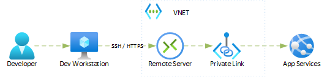

# Azure Developer Experience - Development Environment Options

Development environment options for developing Azure based solutions.

## Problem Definition

Business solution development team at an enterprise organization requiring strong security controls is facing number of challenges when developing Azure based solutions.
The following use cases are representing some of the key challenges.

### 1) Connecting to Azure private IPs from local developer Workstation

Business solution development team at an enterprise organization requiring strong security controls is facing number of challenges when developing Azure based solutions.
Summary of some of the constraints causing difficulties in day of a developer:
- Public endpoints are not allowed in any of the environments including development and test environments. All Azure services have to be either deployed to Azure VNETs or have Private Endpoint and VNET Integration.
- Connection to Azure services with private IPs is provided either via VPN for home office setup or through corporate network connected to Azure VNETs via Express Route private peering.
- All traffic from corporate internal network is going through a Firewall

In order for a developer to connect his developer workstation used as a (local) development environment developer has to:
- Configure trust for self-signed certificate (from their Firewall)
- Request firewall rules to be able to reach new private IPs/DNSs
- switch different configurations depending whether developer is working from home office or from the office location (because network termination is not the same for these options)

### 2) Developing Docker Containers based solutions without Docker Desktop for Windows based Workstations

Business solution development team at an enterprise organization with recent changes of Docker Desktop licensing model for Windows OS has lost access to the tool. The organization concluded that cost of licensing the tool is too high for the organization. Development teams are required to find different solution for Docker container based development.

## Categorization of Developer environment options

The development environment options described in this article could be broadly categorized into three categories:
1) **Local workstation based** - all development tools including any available emulators are installed on development workstation. Any (Azure) dependencies required for development not available as an emulator will be accessed via network connection to Azure service.

2) **VDI based** - Virtual Desktop Infrastructure based solutions (Azure Virtual Desktop, Citrix, Azure DevBox, etc). Developer is using local workstation/laptop as a client for RDP connection to developer Workstation where all development tools are installed. Compile/Build, testing is running in the VDI.

1) **Remote "Server" based** - Is experience similar to terminal access to remote servers. In this case an IDE (e.g. VSCode) is capable connecting to the remote server and performing all actions (git clone, compile/build, (unit)testing) on the remote server. Unlike RDP based solutions which in essence transmits series of images of what remote OS is presenting, in the case of "remote server" based solution, IDE receives the "raw" content and performs rendering of the content and initiates the actions which are executed remotely.

## Description of the options

Brief description of all options under consideration

### Local Workstation based option

**Developer environment category:** Local
Developer workstation connected to corporate network from the office location of via VPN from home office location.
Development tools installed on the workstation (VSCode, Visual Studio, Docker Desktop, etc)

### Remote Server based options

#### (Remote) DevContainers

Some development tools, primarily IDEs, are installed in local Workstation by attaching (local or remote port) to DevContainer with development SDKs and runtimes installed in the container. Build, Run are within the scope of the DevContainer.
Remote DevContainer run behind either public or private IP. In case it is public IP and container needs to access Azure resources within Azure VNET, it would usually require standard edge security protection mechanism (Firewall, etc).

#### VSCode Server (with Remote Tunnel)

Some development tools, primarily IDEs, are installed in local Workstation by attaching (local or remote port) to DevContainer with development SDKs and runtimes installed in the container. Build, Run are within the scope of the DevContainer.
Remote tunnel is opened via HTTPS to remote VM or Container.

#### GitHub CodeSpaces

Cloud hosted and fully managed remote DevContainer development environment. 

### VDI based options

#### Option - Azure DevBox

Virtual Desktop Infrastructure (VDI) type solution. Developer has personal desktop with developer tools installed in the VDI Desktop. The VDI (DevBox) is connected to Azure VNET (Optional).

You can find details about this option in related article [Azure DevBox as an Azure developer environment](https://github.com/microsoft/azure-dev-experience--azure-devbox)

#### Option - AVD (Azure Virtual Desktop)

Managed VDI solution. 
Developer has personal desktop with developer tools installed in the VDI Desktop. The VDI (DevBox) is connected to Azure VNET (Optional)

#### Option - Microsoft Cloud PC

VDI as a Service.
Developer has personal desktop with developer tools installed in the VDI Desktop. The VDI (DevBox) is connected to Azure VNET (Optional)

## Solution Options Summary

Following table summarizes described options:

|                            | Solution Category | VSCode | Visual Studio | Container Build    | Container Debugging | VNET            |
| -------------------------- | ----------------- | ------ | ------------- | ------------------ | ------------------- | --------------- |
| **Local Workstation**      | Local             | x      | x             | x(1)(2) | x(1)(2)  | x(3) |
| **Microsoft Cloud PC**     | VDI               | x      | x             | x(1)(2) | x(1)(2)  | x               |
| **GitHub CodeSpaces**      | Remote Server     | x      |               | x                  | x                   |                 |
| **(Remote) DevContainers** | Remote Server     | x      |               | x                  | ?                   | x               |
| **Azure DevBox**           | VDI               | x      | x             | x(1)(2) | x(1)(2)  | x               |
| **VSCode Server**          | Remote Server     | x      |               | x                  | x                   | x(4) |
| **AVD**                    | VDI               | x      | x             | x(1)(2) | x(1)(2)  | x               |

- (1) With use of WSL in the VDI environment
- (2)  With use of Docker Desktop
- (3)  With VPN
- (4)  Depending where it is hosted. VM, Container Instance, etc

# References

- https://code.visualstudio.com/docs/remote/remote-overview
- https://code.visualstudio.com/docs/remote/vscode-server
- https://containers.dev/
- https://code.visualstudio.com/docs/devcontainers/containers
- https://docs.github.com/en/codespaces/overview
- https://github.com/features/codespaces
